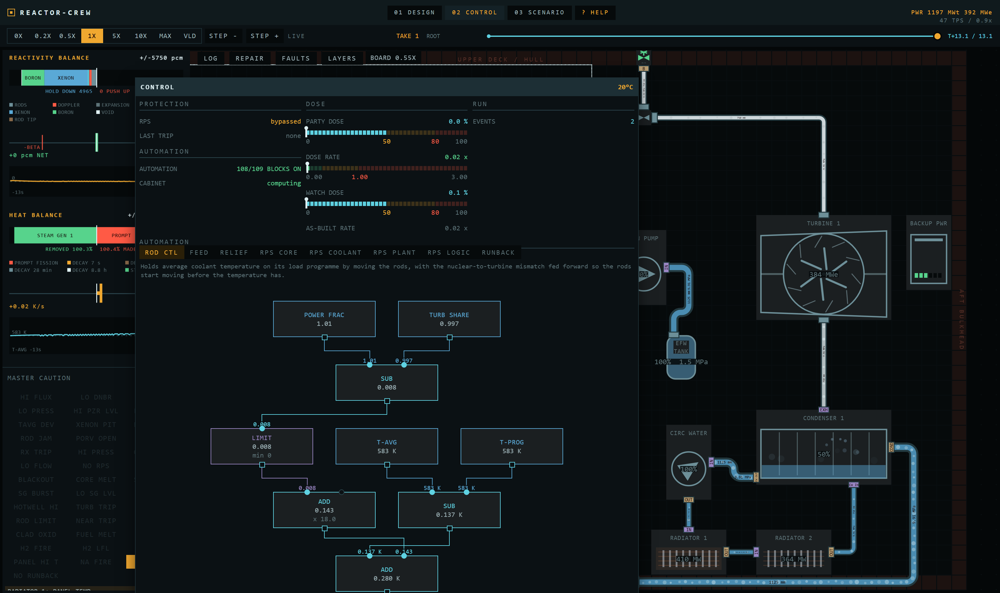

# reactor-crew

A test bed for one feature: a nuclear plant that is **drawn**, not configured. The reactor core,
the lattice and the pipe network are authored on a grid, and the simulation is solved off that
drawing rather than off a table of presets. Everything here exists to evaluate whether that
feature holds up.

Browser prototype. No build step, no modules, no dependencies — plain `<script>` tags, so
`index.html` opens straight off the filesystem.

## Screens

### Design bench

Place machines on a grid, lay pipe, paint the core lattice. A pipe is a named run you drop and then
drag: the ends are cells, the corners are waypoints, and an A\* router finds the lane between them.
Every readout on the left is measured from the drawing: peaking factor, void coefficient, moderator
ratio, thermosiphon head, pipe run length, crew dose rate.


### Control room

The plant you drew, running. Reactivity and heat balance on the left, the annunciator under them,
the plant section in the middle. Every machine on the board opens its own panel.


### Control cabinet

The automation is a cabinet of wired blocks, one section to a tab: sources at the top, the demands
they drive at the bottom, and a wire that says what it carries. Rod control, feedwater, the relief
valves, the runback and every reactor protection channel are built out of the same blocks, and any
of them can be rewired, re-tuned or switched off while the plant runs.



### Scenario, transport, help

A scenario is scripted gestures plus limits: the gestures are done to the plant you drew, and the
limits are judged after the run off the trend archive, so a limit can be edited and the finished run
re-judged without re-simulating a tick. The transport strip records, scrubs and forks takes of a run.
Help is the in-page reference. No screenshots yet.

## What is solved

### Neutronics

| Quantity | Method |
|---|---|
| Total power | Point kinetics, 6 delayed groups, implicit Euler, 4 substeps per 20 ms tick |
| Flux shape, weighted feedback | 1-group neutron diffusion, 14 radial rings × 10 axial levels, successive over-relaxation (SOR) |
| Fission-product poison | Iodine-135 / xenon-135 Bateman chain on a 400× clock |
| `Fq`, rod worth, moderator ratio | Measured off the painted lattice (`latRevolve()`, `modRatio()`) — no reactor-type parameter |
| `Λ`, `α_M`, `α_V` | Derived from that measurement; `α_V` is lost moderation + returned absorption + spectral hardening |

### Core thermal-hydraulics

| Quantity | Method |
|---|---|
| Pellet temperature | Per-node heat balance on a two-leg series path: a fixed solid conductance and a live coolant film |
| Coolant film | The better of a Dittus-Boelter-form flow term and Jens-Lottes (1951) nucleate boiling; the bareness penalty reads the vessel's shortfall of water, not the node's bubbles |
| Void fraction | Drift-flux correlation off quality — a measurement, never a lump |
| Subcooled boiling onset | Saha-Zuber, both branches measured off the drawn bundle (rod diameter, pitch, clad, `D_h`) |
| Channel flow split | Homogeneous two-phase friction multiplier `φ² = 1 + x(1/ρ_r − 1)`, `w ∝ 1/√φ²` at equal Δp |
| Enthalpy-rise flattening | Cross-flow mixing between assemblies |
| Critical heat flux (water) | W-3 (Tong, 1967), evaluated in the paper's own units and converted at the door |
| Past departure | Film coefficient collapses to `DNB_FILM` 0.10 of the single-phase film; a rewetted node recovers |
| Margin (sodium, salt) | Subcooling over hot-channel rise |
| Margin (helium) | Peak fuel temperature against the damage limit |

### Fuel damage — three monotonic per-node integrals

| Failure | Method |
|---|---|
| Clad burst | Hoop stress: fill-gas pressure against core pressure, burst temperature on the NUREG-0630 shape interpolated in log stress |
| Oxidation | Zircaloy-steam, Cathcart-Pawel below 1850 K / Baker-Just above, closed form on oxide thickness² (`x² = x₀² + A·e^(−B/T)·Δt`), exothermic, produces hydrogen |
| Melt | Latent heat paid before the node rises again, so the plateau falls out |
| Release | `NUREG-1465` stage ratios above a dose-anchored gap release |

### Plant hydraulics

| Quantity | Method |
|---|---|
| Pressure everywhere | Every machine face and every pipe run is a node; network Laplacian factored by dense LDLᵀ on a cache key, back-substituted every tick |
| Flow | `w = C·√(2·ρ_upwind·Δp)` on absolute pressure, `C = A/√K` with Colebrook friction, relinearised each solve |
| Elevation | Piezometric head `φ = p + ρgz` — an isothermal loop telescopes to exactly zero |
| Natural circulation | Thermosiphon buoyancy as an edge head off real grid elevation; the share is measured |
| Pressurizer | A two-phase network node: level is its void fraction, heaters and spray are kilowatts, and the surge is a solved flow like any other |
| Saturation curve | Clausius-Clapeyron per fluid, anchored once on the water steam table; a saturated hot leg pressurises off its own curve |
| Cavitation | NPSH at each pump's own suction, not a scalar on total flow |
| Pump | Quadratic curve with the droop as a real resistance in the matrix; affinity laws on shaft speed; a tripped pump coasts down on its own friction |
| Breaks | Choked-flow edges to a containment node; a tube rupture is a differential leak that stops at equalisation |
| Connections | A port is a cell offset on its part, a pipe is a grid cell; `pipeTrace()` walks half-edges and finds the runs. There is no authored list of connections |
| Routing | `runRoute()` is one A\* over (cell, direction, waypoints passed): a route may cross a run, never shares a lane, and refuses rather than rerouting a neighbour |
| Circuits | A connected component of the node graph, numbered by the walk. Fluid, saturation curve and latent heat are properties of the circuit, not of a named loop |
| Fittings | One box part with a `mode`: tee, throttle or relief valve. A gated path is an internal edge priced off that mode; a shut edge is simply absent from the matrix |
| Machine sizes | Real quantities in their own units — kg/s of swallow, kW/K of duty, MPa of pump head, m³ of tank, mm of bore — each with a suggestion computed off the rest of the design |
| Walls | Barlow off the circuit the run stands on; the same law inverted gives the rating a burst is judged against |

### Secondary side

| Quantity | Method |
|---|---|
| Steam generator shell | Two real network nodes, pool and steam space. Its pressure is a solved state; feed and steam are solved edges |
| Tube heat transfer | `T_avg − T_shell` on a conductance in `flow^0.8`, off that machine's own tube flow |
| Feedwater | Solved — pump head into the shell node, regulating valves trimming on relative level error |
| Steam swallowed | Stodola ellipse, `ṁ ∝ (P_s/P_des)·√(1 − (P_c/P_s)²)` |
| Electrical output | Steam times an enthalpy drop off real backpressure |
| Backpressure | Condenser as a pot on its own terminal difference, floored at the air in-leakage limit |
| Intermediate loop | `ROLE.ihx` declares two internal paths, so both streams are real circuits with their own nodes and pumps; the transfer is counterflow NTU. It is also a barrier: a tube rupture behind one costs inventory and releases nothing |
| Final heat rejection | The plant is in space, so the sink is radiator panels: area, coating and what is still unbroken set the temperature the condenser works against |

### Automation

| Quantity | Method |
|---|---|
| A control | A graph of blocks on the design (`D.blocks`), stepped at the head of every tick |
| What it may read | One `SIGNAL` row per reading; a source block reads the plant directly |
| What it may drive | One `SINK` row per demand, and one owner per demand at a time |
| Protection | Ten reactor-protection channels built from the same blocks, plus runback and backup power. 20 ms of cabinet lag on top of a 60 ms design response |
| Losing it | No power or a wrecked cabinet holds every output where it was |

### Compartment

| Quantity | Method |
|---|---|
| Room temperature | A grid heat field fed by each machine's own skin loss and by whatever a break or a stuck relief valve vents into the room |
| Hydrogen | Oxidation makes it, the field carries it, buoyancy drifts it up every open path, and above the lower flammability limit it burns at a laminar velocity the drawn clutter accelerates |
| Metal fire | A spilled coolant that `COOLANT.burn` names lands as a pool with its own mass and temperature; it falls, spreads, stacks and burns at its free surface. What atomises on the way out — a gas Weber number on the hole's own bore — burns in flight |
| Metal meeting water | Sodium against sump water, cell steam or a leaking tube: the heat goes into the stream the metal is in, the hydrogen joins the field, and the leak eats itself wider |
| Defences | A catch pan is a machine that metal can only leave by its drain; an inert gas set drives oxygen and hydrogen at its own cells to zero and diffusion carries it |

### Radiation

| Quantity | Method |
|---|---|
| Dose at a cell | `1/r²` per ray, attenuated over the exact chord through every grid cell by what each component is made of — no line-of-sight test, attenuation is the test |
| Airborne release | An unshielded floor on every cell |

Reference plant at 120 s, one loop, cabinet flying it: rated 1197 MWt, holding 99.8 % — 1195 MWt,
378 MWe, `Fq` 2.644, min node DNBR 1.839, `Tf` 899 K, 1798 t, no trip and zero damage.

## Gaps

Known, roughly in order of how much they bite. `docs/fidelity.md` carries the full list, one row per
difference, each saying whether it was chosen and how sure the real-world figure is.

| Gap | Detail |
|---|---|
| The presets are named after real machines and are not their size | No preset states a power — it is whatever its drawn core rates at. The one figure anyone chose is the stock PWR's anchor. MSRE is 100× its namesake, NuScale 2.8×, EPR a fifth. |
| Time is compressed hard | Xenon runs at 400× and the compartment's heat capacity is scaled so a session can see it. |
| BWR/4 does not get the flow it was drawn for | It rests at 0.907 of design flow where the other seven presets sit within 2 %. The design-time pump sizing guess is a third light. Cause unknown. |
| Steam starvation is not modelled | Real oxidation in a blocked channel runs out of steam and self-limits. Needs a per-channel steam mass balance this solver does not carry. |
| The margin law uses `Fq` where a real plant uses enthalpy-rise peaking | About 1.6× conservative, absorbed into a fit at the rest point only. |
| The BWR void coefficient is 25 % weak | The expression peaks near −1050 pcm against about −1400. A per-family fudge was refused. |
| RBMK-1000 is stable at full power for the wrong reason | It is drawn below its own void, so its coefficient never cashes. It cannot be unstable at low power at all, which is the real machine's whole story. |
| A sodium fire makes no aerosol | The caustic sodium-oxide aerosol is most of what hurts a crew and a plant, and the compartment carries no aerosol species at all. |
| A molten-salt core has no clad and no pellet | The fuel is dissolved in the coolant, and it still gets both failure modes. |
| The condenser's pressure is never solved | It is `psat(condT)` on a pot, so backpressure follows temperature only. |
| Non-water densities are 7–17 % heavy off their operating point | One extrapolation shape for six fluids. |
| No instrument ever lies | Every source block reads the plant directly and is always right, and no reading carries measurement scatter — so voting three channels buys nothing. |
| BN-600 ships with two circuits, not three | Primary sodium goes straight into the generator tubes. The intermediate exchanger can be spliced in on the bench; the preset does not carry it. |
| Oxide thickness is a node mean | Cannot tell a uniformly thin node from a half-consumed one. As coarse as the mesh, the same limit peak fuel temperature has. |
| The crew is never hurt by the compartment | They work at full rate in air at 2000 K. |
| The hydrogen books do not quite close | About 1 % of inventory across a transient. The species is relaxed toward its inflow mix rather than transported in kilograms. |

## Layout

| Path | Contents |
|---|---|
| `index.html` | Page shell, DOM tree, and the only script load order. |
| `src/core/` | Constants, text metrics, canvas primitives, hit testing, pointer. |
| `src/ui/` | The widget kit and one CSS file per screen. |
| `src/data/` | Design parameters, grid layout, pipe network, lattice, radiation field, room heat field, save store. |
| `src/sim/` | Nodal core, tick, linear solver, RNG, recording, scenarios, trends, control cabinet, log. |
| `src/render/` | Plant view, pipe flow, overlay layers, inspector, cabinet graph, charts, router. |
| `src/screens/` | Screen state, design bench, control room, scenario, transport, help. |
| `tools/` | Bundler, headless probes, the sandbox rig, optional static server. |
| `tests/` | Playwright specs, run on request only. |
| `docs/` | `fidelity.md`, the distance from a real machine; `backlog.md`, one line per parked job. |

## Running

Open `index.html` directly, or serve it:

```
node tools/server.js      # http://localhost:8017/
```

Headless, no DOM:

```
node tools/nodom-probe.js
```

Print what an arbitrary plant does — circuits, pots, node temperature, quality, holdup, flows. It
carries no assertions, so nothing in it can fail:

```
node tools/probe.js --list
node tools/probe.js stock --secs=20
```

Isolate one piece of the plumbing and write a CSV of it:

```
node tools/sandbox/sandbox.js --list
node tools/sandbox/sandbox.js netStock --secs=20
```

Regenerate the screenshots above (needs the server on 8017):

```
SHOTS=1 npx playwright test tests/shots.spec.js
```

## Status

Prototype. The physics here is the reference implementation — the intent is to port it, not to
rewrite it. The UI is a study for evaluating feel.
