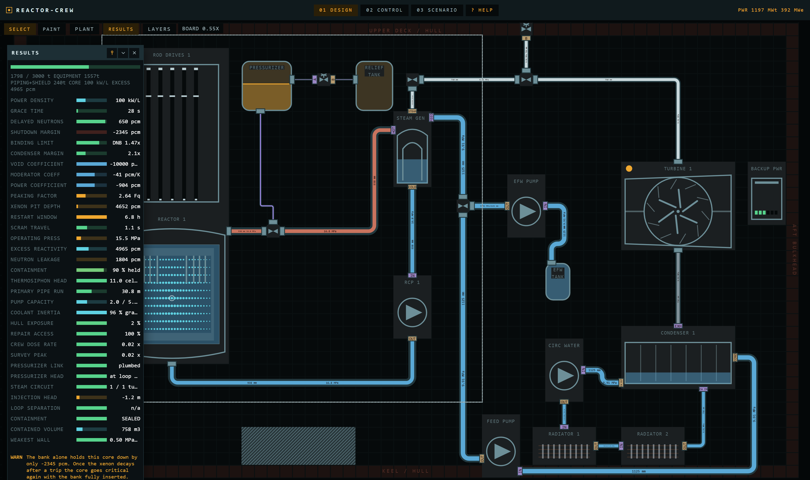
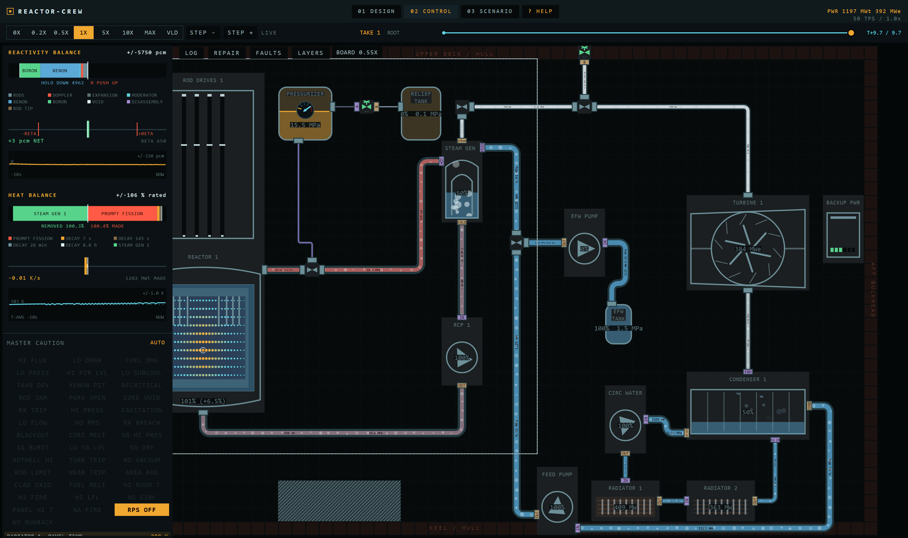
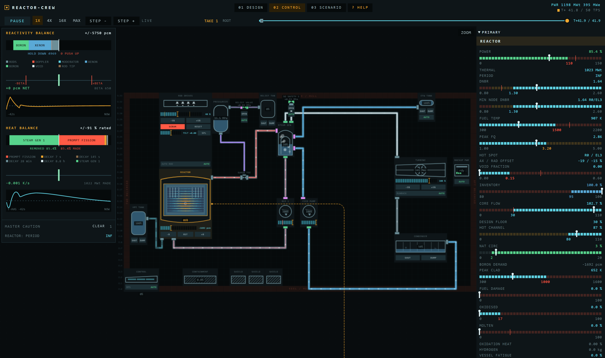

# reactor-crew

A test bed for one feature: a nuclear plant that is **drawn**, not configured. The reactor core,
the lattice and the pipe network are authored on a grid, and the simulation is solved off that
drawing rather than off a table of presets. Everything here exists to evaluate whether that
feature holds up.

Browser prototype. No build step, no modules, no dependencies — plain `<script>` tags, so
`index.html` opens straight off the filesystem.

## Screens

### Design bench

Place machines on a grid, lay pipe cell by cell, paint the core lattice. Every readout on the left
is measured from the drawing: peaking factor, void coefficient, moderator ratio, thermosiphon head,
pipe run length, crew dose rate.



### Control room

The plant you drew, running. Reactivity and heat balances on the left, the plant section in the
middle, per-component instrumentation in the rails on the right.





### Scenario, transport, help

A scenario is scripted gestures plus limits: the gestures are done to the plant you drew, and the
limits are judged after the run off the trend archive, so a limit can be edited and the finished run
re-judged without re-simulating a tick. The transport strip records, scrubs and forks takes of a run.
Help is the in-page reference. No screenshots yet.

## What is solved

### Neutronics

| Quantity | Method |
|---|---|
| Total power | Point kinetics, 6 delayed groups, implicit Euler, 4 substeps per 20 ms tick |
| Flux shape, weighted feedback | 1-group neutron diffusion, 14 radial rings × 10 axial levels, successive over-relaxation (SOR) |
| Fission-product poison | Iodine-135 / xenon-135 Bateman chain on a 400× clock |
| `Fq`, rod worth, moderator ratio | Measured off the painted lattice (`latRevolve()`, `modRatio()`) — no reactor-type parameter |
| `Λ`, `α_M`, `α_V` | Derived from that measurement; `α_V` is lost moderation + returned absorption + spectral hardening |

### Core thermal-hydraulics

| Quantity | Method |
|---|---|
| Pellet temperature | Per-node heat balance, film out on a Dittus-Boelter-form `(G·A)^0.8·(1−α)`; a dry node climbs on its own heat capacity |
| Void fraction | Drift-flux correlation off quality — a measurement, never a lump |
| Subcooled boiling onset | Saha-Zuber, both branches measured off the drawn bundle (rod diameter, pitch, clad, `D_h`) |
| Channel flow split | Homogeneous two-phase friction multiplier `φ² = 1 + x(1/ρ_r − 1)`, `w ∝ 1/√φ²` at equal Δp |
| Enthalpy-rise flattening | Cross-flow mixing between assemblies |
| Critical heat flux (water) | W-3 (Tong, 1967), evaluated in the paper's own units and converted at the door |
| Margin (sodium, salt) | Subcooling over hot-channel rise |
| Margin (helium) | Peak fuel temperature against the damage limit |

### Fuel damage — three monotonic per-node integrals

| Failure | Method |
|---|---|
| Clad burst | Hoop stress: fill-gas pressure against core pressure, burst temperature on the NUREG-0630 shape interpolated in log stress |
| Oxidation | Zircaloy-steam, Cathcart-Pawel below 1850 K / Baker-Just above, closed form on oxide thickness² (`x² = x₀² + A·e^(−B/T)·Δt`), exothermic, produces hydrogen |
| Melt | Latent heat paid before the node rises again, so the plateau falls out |
| Clad temperature | Conductance split between pellet and coolant, fitted once against a 30 K design ΔT |

### Plant hydraulics

| Quantity | Method |
|---|---|
| Pressure everywhere | Node = `partId+side`, edge = routed run at `g = 1/(k·L/bore²)`; network Laplacian factored by dense LDLᵀ on a cache key, back-substituted every tick |
| Elevation | Piezometric head `φ = p + ρgz` — an isothermal loop telescopes to exactly zero |
| Natural circulation | Thermosiphon buoyancy as an edge head off real grid elevation; the share is measured |
| Pressurizer level | Integral of a solved surge flow — expansion is a current at the core node, second substitution against the same factorisation |
| Saturation curve | Clausius-Clapeyron per fluid, anchored once on the water steam table; a saturated hot leg pressurises off its own curve |
| Cavitation | NPSH at each pump's own suction, not a scalar on total flow |
| Breaks | Two choked-flow edges to a containment node; a tube rupture is a differential leak that stops at equalisation |
| Connections | A port is a cell offset on its part, a pipe is a grid cell; `pipeTrace()` walks half-edges and finds the runs. There is no authored list of connections |
| Circuits | A connected component of the node graph, numbered by the walk. Fluid, saturation curve and latent heat are properties of the circuit, not of a named loop |
| Fittings | One box part with a `mode`: tee, throttle or relief valve. A gated path is an internal edge priced off that mode; a shut edge is simply absent from the matrix |
| Machine sizes | Real quantities in their own units — kg/s of swallow, kW/K of duty, MPa of pump head, m³ of tank, mm of bore — each with a suggestion computed off the rest of the design |

### Secondary side

| Quantity | Method |
|---|---|
| Shell pressure | Saturated pot: heat in across the tubes against steam that actually left, so trapped steam raises it |
| Tube heat transfer | `T_avg − T_shell` on a conductance in `flow^0.8` |
| Feedwater | Solved — pump head into the shell node, regulating valves trimming on relative level error |
| Steam swallowed | Stodola ellipse, `ṁ ∝ (P_s/P_des)·√(1 − (P_c/P_s)²)` |
| Electrical output | Steam times an enthalpy drop off real backpressure |
| Backpressure | Condenser as a second pot on its own terminal difference, floored at the air in-leakage limit |
| Intermediate loop | A heat exchanger spliced into a leg, moving heat into a pot. It is also a barrier: a tube rupture behind one costs inventory and releases nothing |
| Final heat rejection | The plant is in space, so the sink is radiator panels: area, coating and what is still unbroken set the temperature the condenser works against |

### Compartment

| Quantity | Method |
|---|---|
| Room temperature | A grid heat field fed by each machine's own skin loss and by whatever a break or a stuck relief valve vents into the room |
| Hydrogen | Oxidation makes it, the field carries it, and above the lower flammability limit it burns at a laminar velocity the drawn clutter accelerates |

### Radiation

| Quantity | Method |
|---|---|
| Dose at a cell | `1/r²` per ray, attenuated over the exact chord through every grid cell by what each component is made of — no line-of-sight test, attenuation is the test |
| Airborne release | An unshielded floor on every cell |

Reference plant at 120 s, one loop: rated 1198 MWt, holding 86.2 % — 1032 MWt, 350 MWe,
`Fq` 2.687, DNBR 1.700, `Tf` 904 K, 1477 t, no trip and zero damage.

## Gaps

Known and deliberate, roughly in order of how much they bite.

| Gap | Detail |
|---|---|
| Steam starvation is not modelled | Real oxidation in a blocked channel runs out of steam and self-limits. Needs a per-channel steam mass balance this solver does not carry. |
| The steam side is a thermal rate, not a hydraulic one | A compressible network is not answerable by this solver, so steam runs have no solved pressure drop. |
| An intermediate loop is a pot, not a circuit | A temperature and a heat capacity, with no node, no edge and no pumps. |
| A molten-salt core has no clad and no pellet | The fuel is dissolved in the coolant, and it still gets both failure modes. |
| Oxide thickness is a node mean | Cannot tell a uniformly thin node from a half-consumed one. As coarse as the mesh, the same limit peak fuel temperature has. |
| A boiling node is penalised where it should be rewarded | The film term reads `(1−α)`, so a boiling-water core's exit node reads a peak clad several hundred kelvin high. Clear of the oxidation threshold, but by less than it looks. |
| A saturated plant trips itself on a load reduction | The temperature programme walks the loop down with load, which on a plant whose pressure *is* its saturation temperature is megapascals. The real fault is a shell over-pressurising at part load with no steam dump. |
| The post-departure film transition width is smoothing, not physics | A wall-superheat criterion is the real answer and would delete the constant. |
| Neither non-water margin law is a published correlation | None exists for those families. Each is an honest ratio; the level each should sit at off its rest point is unverified. |
| Pressurizer void and inventory are correlations | Not solved. |
| The moderator coefficient is the coolant's only | A gas-cooled core reads exactly zero, though a real graphite stack has one. |
| The multi-loop reference plant is incomplete | At four loops the fourth generator, its pump and three safety valves are refused ports for want of a clear lane, and sit unpiped. |

## Layout

| Path | Contents |
|---|---|
| `index.html` | Page shell, DOM tree, and the only script load order. |
| `src/core/` | Constants, text metrics, canvas primitives, hit testing. |
| `src/ui/` | The widget kit and one CSS file per screen. |
| `src/data/` | Design parameters, grid layout, pipe network, lattice, radiation field, room heat field, save store. |
| `src/sim/` | Nodal core, tick, linear solver, RNG, recording, scenarios, trends, log. |
| `src/render/` | Plant view, pipe flow, overlay layers, inspector, charts. |
| `src/screens/` | Screen state, design bench, control room, scenario, transport, help. |
| `tools/` | Bundler, headless probes, auditors, optional static server. |
| `docs/` | The plan written before each larger piece of work. |

## Running

Open `index.html` directly, or serve it:

```
node tools/server.js      # http://localhost:8017/
```

Headless, no DOM:

```
node tools/nodom-probe.js
```

Print what an arbitrary plant does — circuits, pots, node temperature, quality, holdup, flows. It
carries no assertions, so nothing in it can fail:

```
node tools/probe.js --list
node tools/probe.js stock
```

The auditors:

```
node tools/audit-geometry.js && node tools/audit-dom.js
node tools/audit-par.js
```

## Status

Prototype. The physics here is the reference implementation — the intent is to port it, not to
rewrite it. The UI is a study for evaluating feel.
